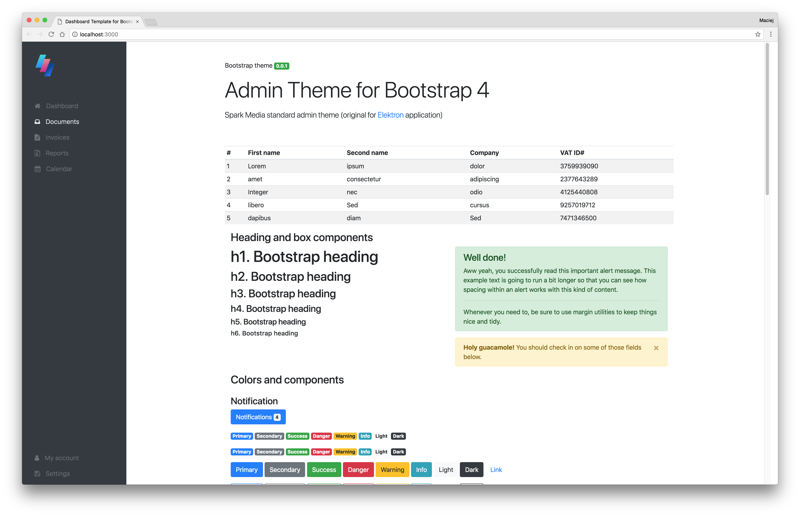

# Spark Bootstrap 4 Dashboard Theme
### Bootstrap 4 Admin Theme



### Project structure

* ```dist/``` - contains compiled pages and assets
    * ```assets/css``` - all compiled and minified CSS files
    * ```assets/fonts``` - all included or copied from npm modules fonts
    * ```assets/img``` - all included images
    * ```assets/js``` - all included or copied from npm modules javascript files
* ```pages/``` - source folder for html and images, css, fonts, js, video etc. assets; gulp uses that folder to copy chosen files to ```dist``` folder
* ```scss/``` - scss files
* ```docs/``` - documentation and additional images

### Installation

You must have installed NPM. In project root folder do:
````
npm install
gulp default
````
This will create ```/dist``` folder, where you could find compiled/copied HTML, CSS, JS and other components.

### Modifications

For initial build:
```
gulp pages-build
```
and then:
```
gulp serve-watch-pages
```
will watch for any modifications in directories: ```pages/*.html```, ```pages/assets/**/*```, ```scss/**/*.scss```.

When ready to release next version:
```
gulp dist-build
```